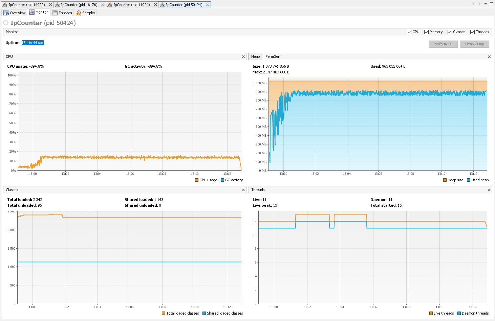

**IP Counter**

Solution for the task: [https://github.com/Ecwid/new-job/blob/master/IP-Addr-Counter.md](https://github.com/Ecwid/new-job/blob/master/IP-Addr-Counter.md)

Total number of IP addresses in file: 8 000 000 000

Number of unique addresses: 1 000 000 000

Counting took 13 min 44 sec and about 900 MB RAM

